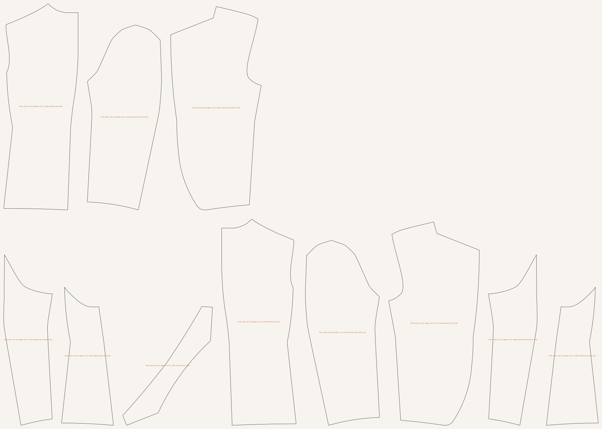
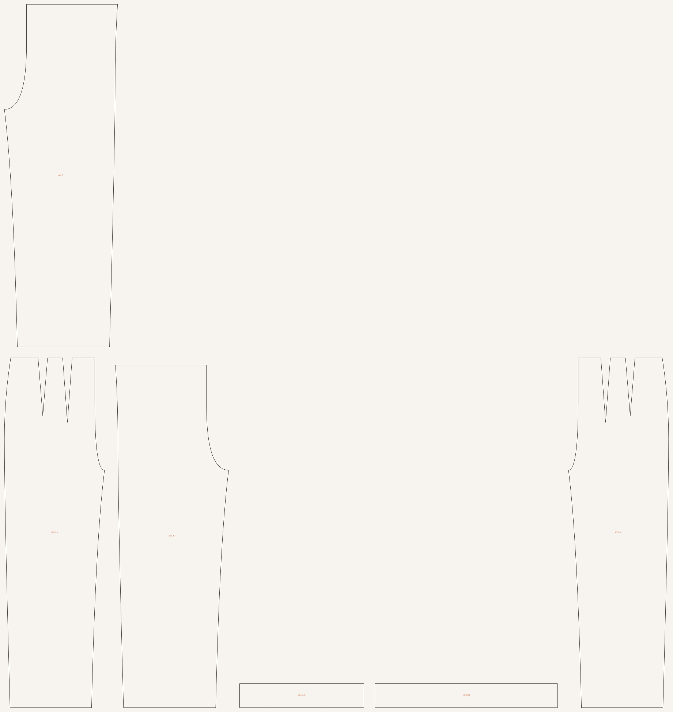
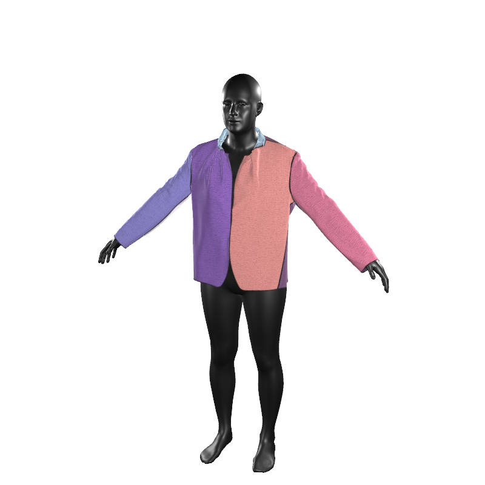
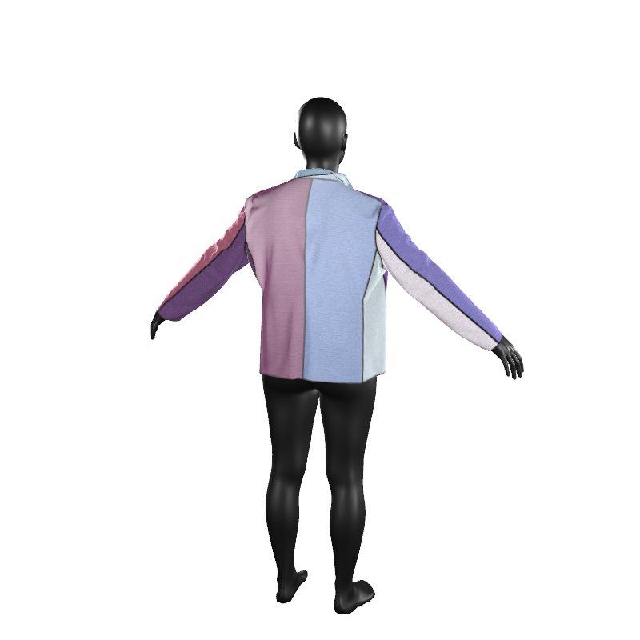
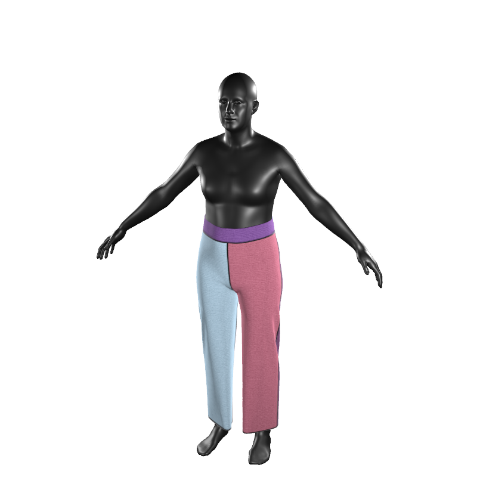
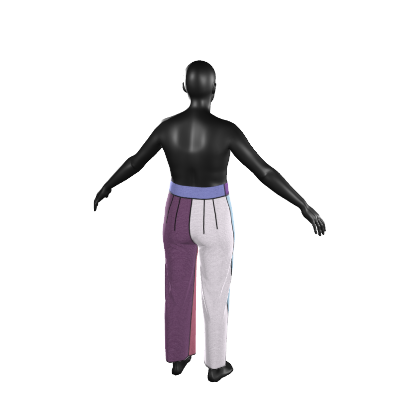
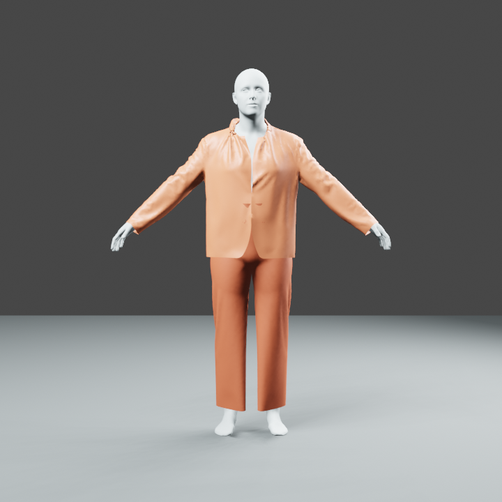
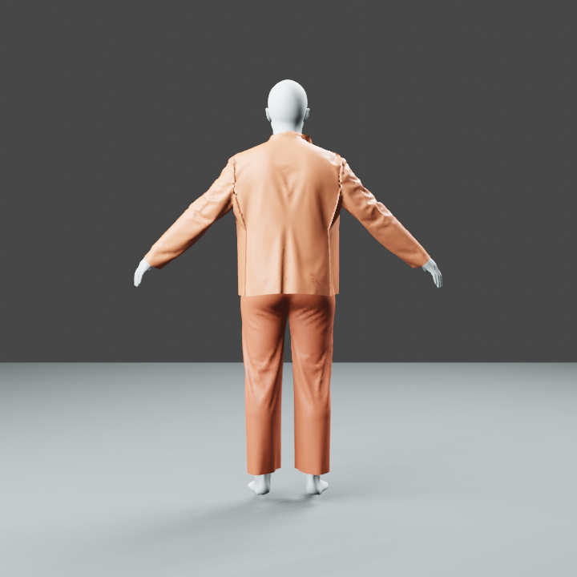
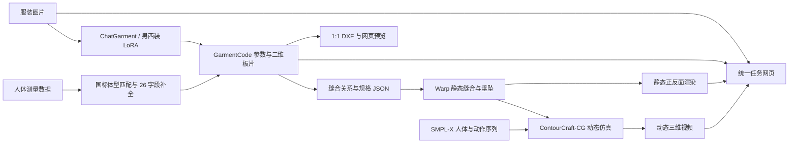
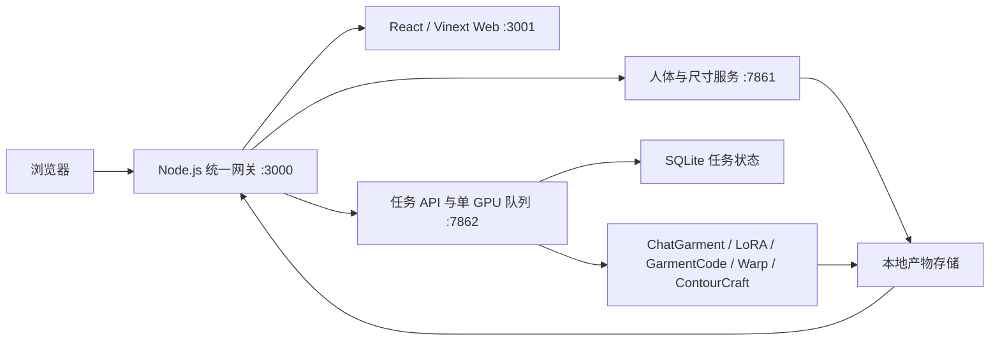

# AI Garment Pattern & 3D Simulation

面向服装制版研究与应用开发的端到端工程。系统接收服装图片和人体尺寸，生成参数化二维板片、缝合规格、静态三维垂坠结果，并通过统一 Web 应用组织任务、预览产物和下载数据。

当前包含两条服装处理分支：

- 通用女装：使用 ChatGarment 基础模型处理上装、下装和连体服装；
- 男西装：使用男西装 LoRA 生成上衣板片，使用基础模型识别下装，并接入 K62 三维装配。

第三方模型权重和受许可的人体资产不随仓库分发。完整依赖与放置方式见 [SETUP.md](SETUP.md) 和 [ASSET_POLICY.md](ASSET_POLICY.md)。

## 西装效果展示

以下产物来自同一次全身西装任务。

| 输入图片 | 西装上衣 DXF 样片预览 | 下装 DXF 样片预览 |
| --- | --- | --- |
|  |  |  |

两张样片图均由相应的 1:1 毫米 DXF 使用同一组轮廓数据生成。

### 西装上衣

| 正面 | 背面 |
| --- | --- |
|  |  |

### 下装

| 正面 | 背面 |
| --- | --- |
|  |  |

### 上下装合穿

| 正面 | 背面 |
| --- | --- |
|  |  |

## 已实现能力

- 通用女装：识别上装、下装和连体服装，输出 GarmentCode 参数、二维板片及三维结果。
- 男西装：使用西装 LoRA 生成上衣参数化板片，迁移到 K62 的 11 片、66 条基础缝合拓扑，并按模型识别的纽扣数连接扣位。
- 西装下装：由 ChatGarment 基础权重独立识别，并使用与 K62 一致的 `mean_all` 基准人体生成板片和静态垂坠结果。
- DXF 样片：从 GarmentCode 规格直接导出 1:1 毫米 DXF，并在网页显示同源 SVG 样片预览；DXF 可单独下载或随任务 ZIP 下载。
- 上下装同穿：提供上衣、下装以及上下装组合的静态正反面渲染。
- 动态仿真：将西装上衣与下装合并后输入 ContourCraft-CG，生成包含人体动作的动态布料视频。
- 人体尺寸适配：接收身高、体重、胸围、腰围、臀围；根据身高和围度匹配国标基础人体并补全 GarmentCode 所需的 26 字段人体 YAML，作为参数化制版的人体基准，使板片的长度、围度和关键位置随目标人体尺寸调整。
- 展示应用：支持单张/批量上传、任务进度、按需查看中间数据、单项下载、一键 ZIP 下载和任务删除。

## 西装LORAv1指标评测

### 西装留出测试集（72 个基础款、216 张图片）

| 指标 | 指标意义 | ChatGarment 官方基础模型权重 | 西装LORAv1权重 |
|---|---|---:|---:|
| Generation Success Rate（越高越好） | 衡量模型能否稳定完成推理并生成非空结果；越高说明推理成功率越高 | 100% | 100% |
| Suit Target Schema Parse Rate（越高越好） | 衡量输出能否按西装目标参数协议成功解析；越高说明结果越容易直接进入西装制版流程 | 0% | 100% |
| Required Six-Field Completeness Rate（越高越好） | 衡量六个必需西装字段是否完整且数据类型有效；越高说明字段缺失或类型错误越少 | 0% | 100% |
| Macro-Averaged Six-Field Pass Rate（越高越好） | 衡量六个西装字段分别按照对应判定规则通过后的宏平均水平；越高说明各字段的总体匹配效果越好 | 不适用 | 78.86% |
| Macro-Averaged Six-Field Balanced Accuracy（越高越好） | 衡量模型对六个字段中不同参数类别的均衡识别能力；越高说明模型越不易偏向样本量较大的类别 | 不适用 | 45.11% |

### 缝合有效性指标

| 测试集 | 指标 | 指标意义 | 结果 |
|---|---|---|---:|
| 西装留出测试集：72 个基础款、216 张图片 | Stitching Failure Rate（越低越好） | 衡量西装模型输出进入 K62/Warp 缝合流程后发生装配失败的比例；越低说明输出的缝合可执行性越好 | 0/216，失败率为 0% |

## 技术流程



## 前后端架构

系统采用浏览器前端、统一网关和 Python 任务服务分层组织。浏览器只访问统一入口，模型推理、制版和三维仿真在后端异步执行，避免长时间 GPU 任务阻塞页面请求。



### 前端

- `gallery_site/` 使用 React、TypeScript 和 Vinext 构建，提供首页、完整处理、人体定制、人体尺寸补全和结果查看等独立页面。
- 前端通过 `/api/jobs` 提交单张或批量图片、服装类型、人体尺寸和动作配置，并定时读取任务状态、当前步骤和进度。
- 输入图片、二维板片、DXF/SVG、规格 JSON、静态正反面渲染和动态视频按处理顺序展示；产物支持单独下载和整任务 ZIP 下载。
- 删除、取消和恢复操作由前端调用任务 API 完成，页面不直接访问模型文件或任务目录。

### 后端

- `gallery_site/gateway.mjs` 是统一 HTTP 网关：页面请求转发到 Web 服务，人体接口转发到人体服务，任务接口和产物请求转发到任务服务。各内部服务默认只监听本机回环地址。
- `pipeline/app_service.py` 提供任务创建、查询、取消、删除、恢复、存储统计和产物下载接口；任务元数据保存在 SQLite 中，上传文件与生成产物按任务隔离保存。
- 后端使用单工作线程按创建顺序执行 GPU 任务，依次编排 ChatGarment/西装 LoRA 推理、人体尺寸补全、GarmentCode 制版、DXF 导出、K62/Warp 静态仿真和 ContourCraft 动态仿真，持续更新步骤与进度。
- `dynamic3d/body_customization/body_service.py` 独立处理国标尺寸补全和可选的定制人体生成，结果通过统一网关返回。
- 每项任务完成后生成产物清单和 `result_bundle.zip`；删除任务时可清理缓存、移入回收区或永久删除，便于控制磁盘占用。

## 主要模块

```text
.
├── pipeline/             # 任务队列、推理编排、进度记录和结果打包
├── gallery_site/         # Web 应用、API 网关和前端测试
├── dynamic3d/            # SMPL-X、Warp、ContourCraft 输入和渲染工具
├── suit_finetune/        # 西装数据集、LoRA 训练、推理与 K62 适配
├── incoming/             # 可公开的 K62 三维装配资产
├── deployment/           # 服务启动、状态检查和 SSH 隧道模板
├── scripts/              # 上游源码安装、预检和批处理脚本
├── upstream_overrides/   # 集成 ChatGarment/GarmentCodeRC 所需覆盖文件
├── PROJECT_MANIFEST.json # 固定的上游版本、运行环境与权重校验值
└── SETUP.md              # 从空白环境重建项目的完整说明
```

## 快速开始

推荐环境为 Ubuntu 22.04、Python 3.10、CUDA 11.8、Node.js 22.13+ 和 24 GB 以上显存的 NVIDIA GPU。

```bash
git clone https://github.com/renyvtao/AI-Garment-Pattern-3D-Demo.git
cd AI-Garment-Pattern-3D-Demo

python3 scripts/bootstrap_sources.py \
  --apply-overrides \
  --install-k62-overlay
```

安装模型、Python 环境、三维资产和前端依赖后启动：

```bash
bash deployment/start_services.sh
```

默认网页地址为 `http://127.0.0.1:3000`。详细步骤、目录约定和自检命令见 [SETUP.md](SETUP.md)。

## 研发入口

- [西装训练与三维适配](suit_finetune/README.md)
- [动态三维模块](dynamic3d/README.md)
- [Web 应用](gallery_site/README.md)
- [第三方资产策略](ASSET_POLICY.md)
- [固定版本与权重校验](PROJECT_MANIFEST.json)

## 上游项目

- [ChatGarment](https://github.com/biansy000/ChatGarment)
- [GarmentCode](https://github.com/maria-korosteleva/GarmentCode)
- [GarmentCodeRC](https://github.com/biansy000/GarmentCodeRC)
- [ContourCraft](https://github.com/Dolorousrtur/ContourCraft)
- [SMPL-X](https://smpl-x.is.tue.mpg.de/)

请同时遵守各上游项目、模型权重、数据集和人体资产的许可证。
