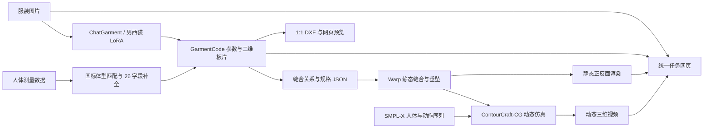

# AI Garment Pattern & 3D Simulation

面向服装制版研究与应用开发的端到端工程。系统接收服装图片和人体尺寸，生成参数化二维板片、缝合规格、静态三维垂坠结果，并通过统一 Web 应用组织任务、预览产物和下载数据。

当前包含两条服装处理分支：

- 通用女装：使用 ChatGarment 基础模型处理上装、下装和连体服装；
- 男西装：使用男西装 LoRA 生成上衣板片，使用基础模型识别下装，并接入 K62 三维装配。

第三方模型权重和受许可的人体资产不随仓库分发。完整依赖与放置方式见 [SETUP.md](SETUP.md) 和 [ASSET_POLICY.md](ASSET_POLICY.md)。

## 西装效果展示

以下产物来自同一次全身西装任务。

| 输入图片 | 西装上衣 DXF 样片预览 | 下装 DXF 样片预览 |
| --- | --- | --- |
|  |  |  |

两张样片图均由相应的 1:1 毫米 DXF 使用同一组轮廓数据生成。

### 西装上衣

| 正面 | 背面 |
| --- | --- |
|  |  |

### 下装

| 正面 | 背面 |
| --- | --- |
|  |  |

### 上下装合穿

| 正面 | 背面 |
| --- | --- |
|  |  |

## 已实现能力

- 通用女装：识别上装、下装和连体服装，输出 GarmentCode 参数、二维板片及三维结果。
- 男西装：使用西装 LoRA 生成上衣参数化板片，迁移到 K62 的 11 片、66 条基础缝合拓扑，并按模型识别的纽扣数连接扣位。
- 西装下装：由 ChatGarment 基础权重独立识别，并使用与 K62 一致的 `mean_all` 基准人体生成板片和静态垂坠结果。
- DXF 样片：从 GarmentCode 规格直接导出 1:1 毫米 DXF，并在网页显示同源 SVG 样片预览；DXF 可单独下载或随任务 ZIP 下载。
- 上下装同穿：提供上衣、下装以及上下装组合的静态正反面渲染。
- 动态仿真：将西装上衣与下装合并后输入 ContourCraft-CG，生成包含人体动作的动态布料视频。
- 人体尺寸适配：接收身高、体重、胸围、腰围、臀围；根据身高和围度匹配国标基础人体并补全 GarmentCode 所需的 26 字段人体 YAML，作为参数化制版的人体基准，使板片的长度、围度和关键位置随目标人体尺寸调整。
- 展示应用：支持单张/批量上传、任务进度、按需查看中间数据、单项下载、一键 ZIP 下载和任务删除。

## 西装LORAv1指标评测

### 西装留出测试集（72 个基础款、216 张图片）

| 指标 | 指标意义 | ChatGarment 官方基础模型权重 | 西装LORAv1权重 |
|---|---|---:|---:|
| 生成成功率（越高越好） | 越高说明模型推理越稳定，能够持续生成非空结果 | 100% | 100% |
| 西装目标结构解析成功率（越高越好） | 越高说明输出越符合西装参数协议，能够直接进入西装制版流程 | 0% | 100% |
| 西装六字段完整率（越高越好） | 越高说明西装参数缺失和类型错误越少 | 0% | 100% |
| 六字段宏平均命中率（越高越好） | 越高说明六个西装属性字段的总体预测准确性越高 | 不适用 | 78.86% |
| 六字段平衡准确率（越高越好） | 越高说明模型对不同参数类别的识别更加均衡，类别塌缩现象更少 | 不适用 | 45.11% |

### 缝合有效性指标

| 评测来源 | 测试集 | 指标 | 指标意义 | 结果 |
|---|---|---|---|---:|
| ChatGarment 原论文报告值 | Dress4D | 缝合失败率（越低越好） | 越低说明生成的板片和缝合关系越容易形成有效三维服装 | 0% |
| ChatGarment 原论文报告值 | CLoSE | 缝合失败率（越低越好） | 越低说明生成的板片和缝合关系越容易形成有效三维服装 | 0% |
| 西装LORAv1权重评测结果 | 西装留出测试集：72 个基础款、216 张图片 | 缝合失败率（越低越好） | 越低说明西装模型输出进入 K62/Warp 缝合流程后的成功率越高 | 0/216，失败率为 0% |

## 技术流程



## 主要模块

```text
.
├── pipeline/             # 任务队列、推理编排、进度记录和结果打包
├── gallery_site/         # Web 应用、API 网关和前端测试
├── dynamic3d/            # SMPL-X、Warp、ContourCraft 输入和渲染工具
├── suit_finetune/        # 西装数据集、LoRA 训练、推理与 K62 适配
├── incoming/             # 可公开的 K62 三维装配资产
├── deployment/           # 服务启动、状态检查和 SSH 隧道模板
├── scripts/              # 上游源码安装、预检和批处理脚本
├── upstream_overrides/   # 集成 ChatGarment/GarmentCodeRC 所需覆盖文件
├── PROJECT_MANIFEST.json # 固定的上游版本、运行环境与权重校验值
└── SETUP.md              # 从空白环境重建项目的完整说明
```

## 快速开始

推荐环境为 Ubuntu 22.04、Python 3.10、CUDA 11.8、Node.js 22.13+ 和 24 GB 以上显存的 NVIDIA GPU。

```bash
git clone https://github.com/renyvtao/AI-Garment-Pattern-3D-Demo.git
cd AI-Garment-Pattern-3D-Demo

python3 scripts/bootstrap_sources.py \
  --apply-overrides \
  --install-k62-overlay
```

安装模型、Python 环境、三维资产和前端依赖后启动：

```bash
bash deployment/start_services.sh
```

默认网页地址为 `http://127.0.0.1:3000`。详细步骤、目录约定和自检命令见 [SETUP.md](SETUP.md)。

## 研发入口

- [西装训练与三维适配](suit_finetune/README.md)
- [动态三维模块](dynamic3d/README.md)
- [Web 应用](gallery_site/README.md)
- [第三方资产策略](ASSET_POLICY.md)
- [固定版本与权重校验](PROJECT_MANIFEST.json)

## 上游项目

- [ChatGarment](https://github.com/biansy000/ChatGarment)
- [GarmentCode](https://github.com/maria-korosteleva/GarmentCode)
- [GarmentCodeRC](https://github.com/biansy000/GarmentCodeRC)
- [ContourCraft](https://github.com/Dolorousrtur/ContourCraft)
- [SMPL-X](https://smpl-x.is.tue.mpg.de/)

请同时遵守各上游项目、模型权重、数据集和人体资产的许可证。
